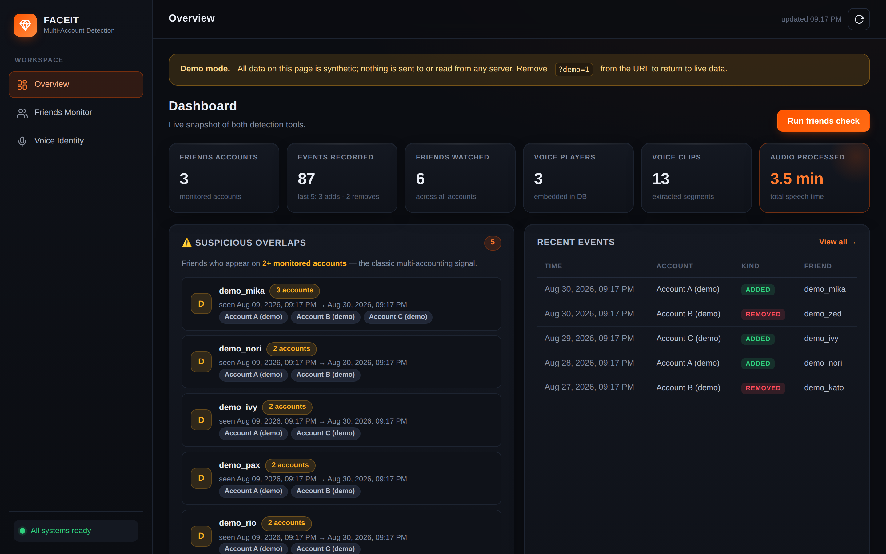

# FACEIT Identity Audit

[](https://github.com/louisfilhol/faceit-identity-audit/actions/workflows/ci.yml)
[](LICENSE)
[](pyproject.toml)
[](frontend)

A local full-stack investigation dashboard that combines changes in public
FACEIT friendship networks with optional speaker-similarity evidence from CS2
demos. It is built with React and TypeScript on the frontend and FastAPI and
Python on the backend. Results are deliberately presented as signals to review,
never as proof of identity.



The dashboard uses **Signals** as its short product label.

## What it demonstrates

- **Full-stack product development:** a typed React interface, FastAPI endpoints,
  SQLite persistence, background ingestion jobs, local configuration, and a
  production build served by one process.
- **Applied ML integration:** CS2 voice extraction, optional VAD, SpeechBrain
  speaker embeddings, similarity search, and conservative `same`, `different`,
  or `inconclusive` results.
- **Engineering for reliability and privacy:** automated tests and CI, bounded
  uploads, local-first storage, consent-aware matching, synthetic demo data, and
  checks that prevent credentials or private artifacts from entering Git.

> **Responsible-use notice:** This project is for education and authorized,
> lawful investigations. Comply with FACEIT's Terms of Service and applicable
> privacy/biometric laws, obtain consent or another valid legal basis, minimize
> retained data, and never use results to harass, dox, or publicly accuse a
> player. Voice similarity and friendship overlap are supporting signals, not
> proof of identity. The software is provided without warranty.

## Architecture

| Component | What it does | Data and network behavior |
|---|---|---|
| Web UI (React + TypeScript) | Dashboard, configuration, scheduled checks, history, demo ingestion, and voice comparison | Binds to `127.0.0.1` by default; stores data locally |
| Friends monitor | Diffs public friends lists and optionally posts Discord alerts | Calls public FACEIT endpoints; stores SQLite snapshots and a local log |
| Voice identity linker | Extracts per-player audio, creates speaker embeddings, and returns `same`, `different`, or `inconclusive` evidence | Downloads a model on first use; voiceprints and demos stay in ignored local storage |
| FACEIT demo sync | Uses a logged-in local browser session to retrieve recent demos | Optional Playwright Chromium profile; unofficial endpoints may change |

The frontend is a React 19 + TypeScript (strict) + Vite application using
React Router with hash routes (`#/overview`, `#/friends`, `#/voice`) and
TanStack Query for server state, caching, and background-job polling. In
production, FastAPI serves the compiled bundle directly from `frontend/dist`;
no Node process is needed at runtime.

## Quickstart

Linux x86_64, Python 3.11 or 3.12, and Node.js 20+ are required for the
complete workflow. Install `curl`, `unzip`, and `ffmpeg` first.

```bash
git clone https://github.com/louisfilhol/faceit-identity-audit.git
cd faceit-identity-audit
./setup.sh
./run.sh
```

Open <http://127.0.0.1:8000>. Setup creates ignored local copies of
`friends-monitor/config.json` and `voice-identity-linker/.env`, installs the
pinned Python environment, and builds the React dashboard (`npm ci` +
`npm run build` inside `frontend/`). The friends scheduler starts disabled.

The default setup installs the fully resolved `requirements.lock`, then downloads
`csgove` and Playwright Chromium. Expect roughly **5–20 minutes**, **2–3 GB of
disk**, and another
~85 MB model download on the first voice operation. Demo files and transient WAVs
need additional space; the app reserves 5 GiB free by default. Use
`./setup.sh --skip-browser` if demo auto-sync is not needed, or
`./setup.sh --skip-frontend` to skip the dashboard build.

Want a tour without FACEIT credentials, private data, or model downloads? Open
<http://127.0.0.1:8000/?demo=1#/overview> — demo mode is read-only, clearly
banner-marked, answered entirely from local synthetic fixtures (requests never
touch the server), and never activates without the explicit `?demo=1`
parameter.

## Development

Two processes give you hot-reload on both sides:

```bash
./setup.sh --dev --skip-frontend   # Python environment + dev tools
cd frontend && npm ci              # Frontend dependencies (once)
npm run dev                        # Vite dev server on http://127.0.0.1:5173,
                                   # proxying /api to FastAPI
# in another shell, from the repo root:
./run.sh                           # FastAPI on http://127.0.0.1:8000
```

Frontend commands (run inside `frontend/`):

| Command | Purpose |
|---|---|
| `npm run dev` | Vite dev server with hot reload |
| `npm run build` | Type-check and produce the production bundle in `dist/` |
| `npm run lint` / `npm run format:check` | ESLint / Prettier |
| `npm run typecheck` | Strict TypeScript check |
| `npm test` | Vitest + React Testing Library unit tests |

### Tests

```bash
./setup.sh --dev --skip-browser
.venv/bin/pytest                     # Python (all three suites, slow tests skipped)
.venv/bin/ruff check .               # Python lint
.venv/bin/ruff format --check .      # Python formatting
cd frontend && npm ci && npm test    # Frontend unit tests
```

`pytest` at the repository root discovers all three Python test suites; the
web smoke test verifies that the built React app is served (build `frontend/`
first or let CI provide the artifact). Frontend tests cover routing, the API
client, health states, friendship-overlap computation, the friends
configuration flow, ingest polling lifecycle and cleanup, the
voice-unavailable state, safe rendering of server-provided strings, and
demo-mode activation plus its offline fixture coverage (demo requests are
never sent to the network). Tests marked `slow` are excluded by default and
from CI so no secret, browser login, external service, demo, or model
download is required. Optional hooks are installed with
`.venv/bin/pre-commit install`.

## Evaluation and limitations

The speaker-similarity feature is experimental and is not calibrated for
production identity decisions. The default threshold of `0.5` is a local
starting point, not a universal operating threshold. Project-specific false
match, false non-match, and equal error rates are not currently published;
metrics reported for the upstream model would not automatically transfer to
compressed, noisy in-game voice chat.

The verification logic therefore requires repeated evidence from multiple
demos, compatible preprocessing, sufficient agreement between demo pairs, and
a score outside an uncertainty band before returning a definitive result. In
all other cases it returns `inconclusive`. The tools in
[`voice-identity-linker/eval`](voice-identity-linker/eval) can generate
same-speaker and different-speaker pairs, compare VAD policies, and tune a
threshold on a separate, consented dataset.

Other important limitations:

- Friendship overlap shows correlation, not identity, and can have ordinary
  social explanations.
- FACEIT demo sync relies on unofficial endpoints and may break when the site
  changes.
- Jobs are held in memory and SQLite is used deliberately because this is a
  single-user, localhost tool; it is not a distributed or multi-tenant service.
- Any real-world use needs a documented legal basis, data-retention policy,
  representative evaluation data, and human review.

## Configuration

Friends-monitor settings live in ignored `friends-monitor/config.json`; start
from [config.example.json](friends-monitor/config.example.json). It accepts a
Discord webhook, optional numeric Discord mention, scheduler settings, and an
array of exact FACEIT nicknames/profile URLs/GUIDs. See the
[friends-monitor guide](friends-monitor/README.md).

Voice settings live in ignored `voice-identity-linker/.env`; the complete
template is [.env.example](voice-identity-linker/.env.example).

| Variable | Default | Purpose |
|---|---:|---|
| `DATA_DIR` | `voice-identity-linker/data` | Private demos, browser profile, models, WAVs, and SQLite DB |
| `MAX_UPLOAD_BYTES` | 1 GiB | Maximum streamed upload size |
| `MIN_FREE_DISK_BYTES` | 5 GiB | Free-space floor maintained during upload/extraction |
| `DELETE_WAV_AFTER_EMBEDDING` | `1` | Remove reproducible WAVs after embedding |
| `RETAIN_COMPRESSED_DEMO_ONLY` | `1` | Remove decompressed copies of compressed demos |
| `MODEL_NAME` | SpeechBrain ECAPA | Hugging Face speaker model identifier |
| `DEFAULT_THRESHOLD` | `0.5` | Local starting threshold; tune on consented held-out data |
| `VAD_ENABLED` | `1` | Strip non-speech with Silero VAD |
| `INVESTIGATIVE_MODE` | `0` | When `1`, include non-consented players in cross-account search |
| `FACEIT_SYNC_HEADLESS` | `0` | Run optional login/sync browser headlessly |
| `FACEIT_CDP_ENDPOINT` | unset | Attach to an existing Chrome debugging endpoint |
| `HF_HUB_OFFLINE` | `0` in `run.sh` | Set to `1` only after the model is cached |
| `PORT` | `8000` | Web server port |

To cache the model during setup, run `PREDOWNLOAD_MODEL=1 ./setup.sh`. After a
successful download, `HF_HUB_OFFLINE=1 ./run.sh` prevents Hugging Face network
checks. Offline mode before the first download makes voice operations fail.

## Command-line tools

The friends monitor uses only Python's standard library:

```bash
cd friends-monitor
python3 faceit_friends.py --help
```

The voice CLI uses the root environment:

```bash
cd voice-identity-linker
../.venv/bin/python cli.py --help
```

Detailed commands and privacy controls are in the
[voice identity linker guide](voice-identity-linker/README.md).

## Project structure

```text
.
├── web/                     FastAPI app, routers, and tests
│   └── (serves frontend/dist at / in production)
├── frontend/                React 19 + TypeScript + Vite dashboard
│   └── src/
│       ├── api/             Typed API client and endpoint modules
│       ├── components/      Layout shell and shared UI (toasts, pills…)
│       ├── features/        One directory per view (overview/friends/voice)
│       ├── hooks/           Health, players, ingest polling, demo list
│       ├── demo/            Opt-in synthetic demo mode (?demo=1)
│       └── styles/          Light product theme and responsive layout
├── friends-monitor/         Standard-library CLI and tests
├── voice-identity-linker/   Voice CLI, pipeline, evaluation tools, and tests
├── scripts/                 Release-safety checks
├── setup.sh                 Pinned unified installer (Python + frontend)
├── run.sh                   Local web launcher
├── pyproject.toml           Python, pytest, formatter, and lint configuration
└── requirements.lock        Fully resolved Linux x86_64 runtime environment
```

All runtime databases, logs, demos, browser profiles, downloaded binaries,
models, caches, local configuration, `node_modules`, and the generated
`frontend/dist` build are ignored by Git.

### Why FastAPI and SQLite stay

The backend deliberately remains FastAPI + SQLite. The workload is a
single-user, localhost investigation tool: one process, one operator, small
datasets. FastAPI provides typed request bodies, async endpoints for streamed
demo uploads, and a self-documenting OpenAPI schema; the response types on the
frontend (`frontend/src/api/types.ts`) are handwritten against the routers and
kept in sync when an endpoint shape changes. SQLite keeps every voiceprint and
friendship snapshot in one inspectable local file with zero operational
surface. A second service or a network database would add attack surface and
setup cost without any benefit for this deployment model.

## FAQ and troubleshooting

**The page at `/` says "Frontend build not found".** Build the dashboard:
`cd frontend && npm ci && npm run build` (or re-run `./setup.sh`), then
reload. The `/api/*` endpoints work regardless.

**The UI starts but voice operations say the model is unavailable.**  Run once
with `HF_HUB_OFFLINE=0`, or pre-download with
`PREDOWNLOAD_MODEL=1 ./setup.sh`. Then offline mode is safe.

**Playwright login does not open or Cloudflare rejects it.** Re-run
`.venv/bin/playwright install chromium`, use headful mode, or attach a logged-in
Chrome through `FACEIT_CDP_ENDPOINT`. Browser automation and unofficial FACEIT
endpoints can break without notice.

**`csgove` or audio extraction fails.** The complete voice workflow supports
Linux x86_64. Confirm `voice-identity-linker/bin/csgove` is executable and
`ffmpeg -version` succeeds, then re-run `./setup.sh`.

**Friends checks return 403/404.** Nicknames are case-sensitive. A 404 usually
means the account identifier is invalid; a 403 can indicate a changed FACEIT or
Cloudflare policy. See the [friends troubleshooting section](friends-monitor/README.md#troubleshooting).

**Can results prove multi-accounting?** No. Friendship overlap and speaker
similarity can be wrong or misleading. Require repeated independent evidence,
respect consent, and never publish an automated accusation.

## License and third-party software

Project code is licensed under [AGPL-3.0-only](LICENSE). The installer downloads
the separate [`csgove` voice extractor](https://github.com/akiver/csgo-voice-extractor),
which is MIT-licensed; it is not stored in this repository. See
[CONTRIBUTING.md](CONTRIBUTING.md), [SECURITY.md](SECURITY.md), and the
[Code of Conduct](CODE_OF_CONDUCT.md) before participating.

FACEIT and Counter-Strike are trademarks of their respective owners. This
project is unaffiliated with and not endorsed by FACEIT or Valve.
